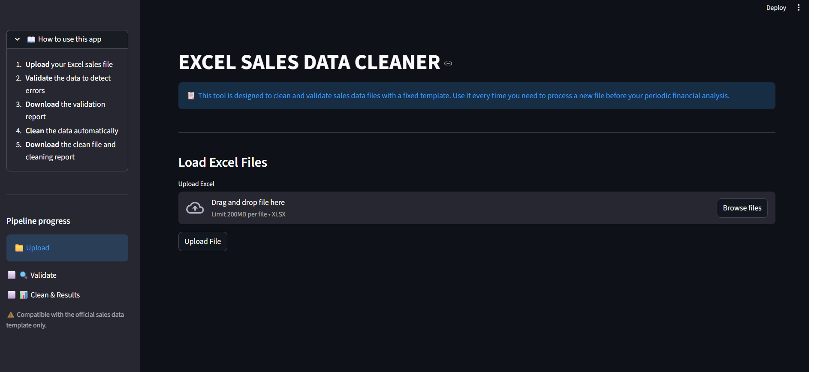
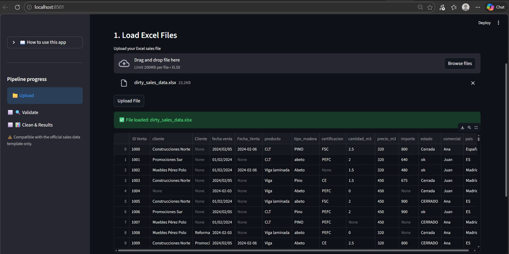
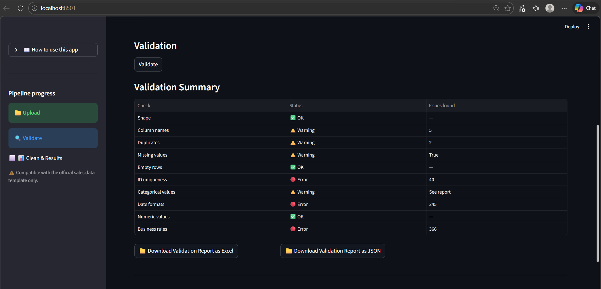
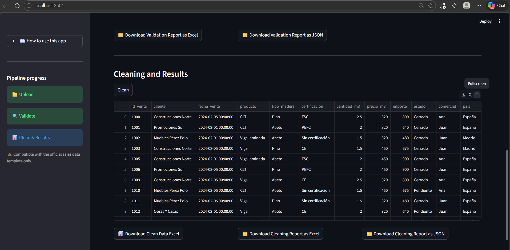

# 📊 Excel Sales Data Cleaner

**Pipeline automatizado de validación y limpieza de datos de ventas en Excel**, diseñado para transformar archivos periódicos en datasets fiables y listos para análisis financiero.  

**Automated validation and cleaning pipeline for Excel sales data**, designed to transform periodic files into reliable, analysis-ready datasets.

👉 De Excel desordenado a datos listos para análisis en segundos  
👉 From messy Excel files to analysis-ready datasets in seconds  

---

## 🚀 Demo

**Flujo de trabajo de ejemplo desde datos en bruto hasta resultados finales**  
**Example workflow from raw input to clean output**

 
 
  


---

## 🎯 Problema que resuelve / Problem it solves

Equipos de ventas y finanzas trabajan con Excel exportados periódicamente que:

- contienen errores, duplicados y valores inconsistentes  
- requieren limpieza manual antes de cualquier análisis  
- introducen riesgo en reporting y cierres financieros  

Sales and finance teams often work with periodically exported Excel files that:

- contain errors, duplicates, and inconsistent values  
- require manual cleaning before analysis  
- introduce risk into reporting and financial processes  

Este proyecto automatiza ese proceso, reduciendo el esfuerzo manual y mejorando la fiabilidad de los datos.  

This project automates that process, reducing manual effort and improving data reliability.

---

## 🧩 ¿Qué hace la aplicación? / What does the app do?

Permite a usuarios no técnicos:

1. 📁 Subir un Excel  
2. 🔍 Detectar errores automáticamente  
3. 🧹 Limpiar los datos  
4. 📥 Descargar resultados listos para análisis  

It allows non-technical users to:

1. 📁 Upload an Excel file  
2. 🔍 Automatically detect errors  
3. 🧹 Clean the data  
4. 📥 Download analysis-ready results  

---

## 🧠 Enfoque técnico / Technical approach

Construido como un **pipeline modular de datos**:

- Capa de validación → control de calidad de datos  
- Capa de limpieza → transformación y filtrado  
- Capa de salida → generación de outputs para negocio  

Built as a **modular data pipeline**:

- Validation layer → data quality checks  
- Cleaning layer → transformation and filtering  
- Output layer → business-ready exports  

Esto permite:

- separación de responsabilidades  
- reutilización de lógica  
- escalabilidad del sistema  

This enables:

- clear separation of responsibilities  
- reusable logic  
- scalable design  

---

## 🧪 Validaciones / Validation checks

- estructura del dataset  
- nombres de columnas  
- duplicados  
- valores nulos  
- formatos de fecha  
- valores numéricos  
- reglas de negocio (`id_venta`, `importe`, etc.)  

- dataset structure  
- column naming  
- duplicates  
- missing values  
- date formats  
- numeric validation  
- business rules (`id_venta`, `importe`, etc.)  

---

## 🧹 Limpieza / Cleaning logic

- eliminación de filas vacías  
- eliminación de duplicados  
- imputación de valores  
- recalculo de métricas  
- filtrado de registros inválidos  

- removal of empty rows  
- duplicate removal  
- value imputation  
- metric recalculation  
- filtering invalid records  

---

## 📦 Outputs

- Informe de validación (Excel / JSON)  
- Dataset limpio formateado  
- Informe de limpieza  

- Validation report (Excel / JSON)  
- Clean formatted dataset  
- Cleaning report  

---

## ⚠️ Requisito / Requirement

Compatible con una estructura definida de datos de ventas  
(e.g. columnas como `id_venta`, `importe`)  

Compatible with a defined sales data structure  
(e.g. fields such as `id_venta`, `importe`)  

---

## ⚙️ Uso rápido / Quick start

```bash
git clone https://github.com/CrisRguezA/excel-data-cleaner.git
cd excel-data-cleaner
pip install -r requirements.txt
streamlit run client_app/app.py
```

---

## 📁 Estructura / Structure

```
client_app/   → interfaz Streamlit / Streamlit interface  
src/          → lógica de validación y limpieza / validation & cleaning logic  
data/         → inputs  
outputs/      → resultados / outputs  
```

---

## 👤 Autora / Author

Cristina Rodríguez Arroyo  
Data Engineer  
https://github.com/CrisRguezA

---

## 💡 Contexto / Context

Proyecto desarrollado como simulación de entregable profesional, enfocado en:

- calidad de datos  
- automatización de procesos  
- diseño de pipelines  
- generación de outputs para negocio  

Project developed as a realistic client-facing deliverable focused on:

- data quality  
- process automation  
- pipeline design  
- business-ready outputs  
